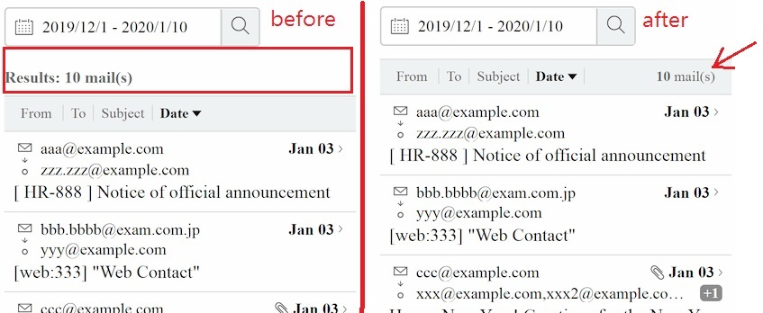
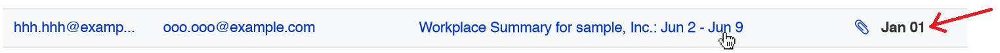
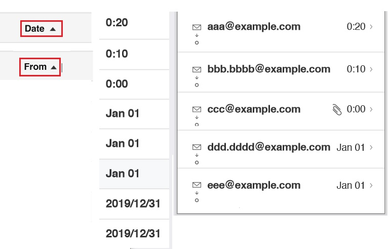
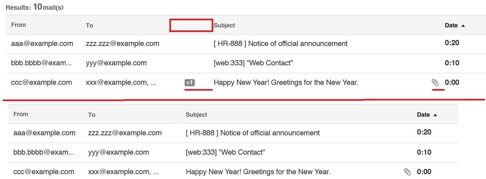
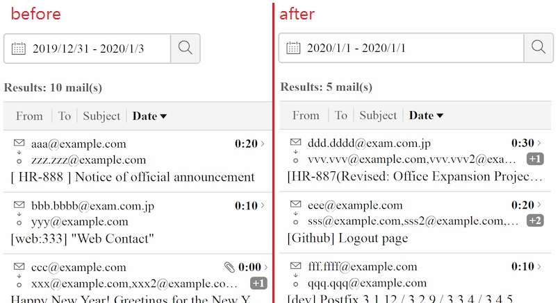

# IMPROVEMENTS.md

## Results: mail(0)
On mobile mode, "Results mail" can margin into table header, then it will have **MORE SPACE**, and screen are more clean.

## Inconsistent hover effect
The **"hover effect"** should be consistency.  
  

## Inconsistent sort design
According to the design, both "**sorted date**" and "**sorted from**" are **UP** arrow.  
Its means that "**sorted date**" and "**sorted from**" should be **SAME** order. And we can see
- date field: From "The most **recent/latest** dates" to "The most **oldest** dates".
  - It's **Descending** order
- from field: From "**A**" to "**Z**"
  - It's **Ascending** order

So the "**date field**"'s arrow should be a **DOWN** arrow (on design)
- The **UP** arrow represent "ascending order", which means the oldest dates will be at the top of the list
- (I made this change on my repo.)

ref:
- [Wiki about Sorting](https://en.wikipedia.org/wiki/Sorting)
- [bootstrap-table](https://examples.bootstrap-table.com/#extensions/multiple-sort.html)
- [material-ui table](https://material-ui.com/components/tables/)

## Unknown's meta data
- The "+1/+2" is missing header,and it make me confuse what its meaning.

In my opinion
- The icon leave too much space. It should be more close to "Subject". Just like "Attachment" icon.
- or, just remove the whole field.

## Align DatePicker into center ()
In my opinion, align DatePicker to **fill rest of space** has better user experience on mobile mode (more fit mobile user experience).  

  
