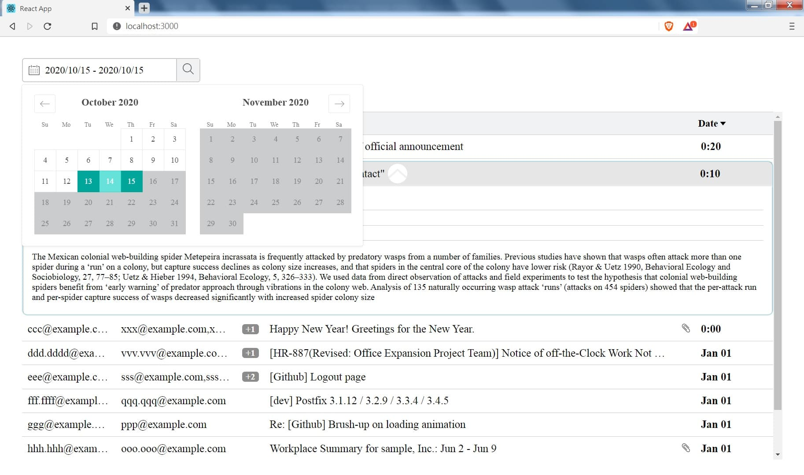
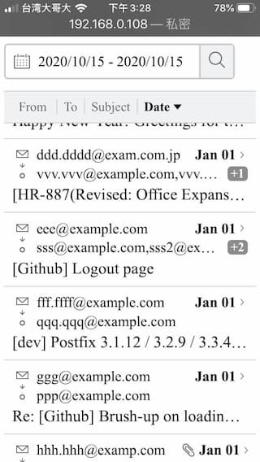

# Jacky's HENNGE Admission Challenge
- [REPORT.md](./REPORT.md)
- [IMPROVEMENTS.md](./IMPROVEMENTS.md)

## about this demo
- framework: `react` (`create-react-app`)
- style engine: css-in-js (`styled-components`)
- others
  - `storybook` for UI component develop

## Clone and Install
```
git clone https://github.com/flameddd/hennge_challenge
cd hennge_challenge
npm install
npm start
```

then visit `http://localhost:3000/`

## Date Set
- [dataset.js](./src/dataset.js)
- email date range from `2019/12/31 0:30` to `2020/1/3 0:20`
- filter **Out of above date range** to see **Empty Result** page.

## Folder structure and File 

```
\---src
  |   App.js            // App Entry, Layout
  |   colors.js         // define color palette
  |   constants.js      // define constant, enums
  |   dataset.js        // fake data set for demo 
  |   
  +---assets            // image asset from "frontend_resources.zip" 
  +---Components        // UI components
  |     EmptyResult.js
  |     ExtendMail.js
  |     Normalize.js
  |     ResultTitle.js
  |     DatePicker.js
  |     Table.js
  | 
  \---utils           // utility function
\---screenshots       // image for README, REPORT and IMPROVEMENTS present
```


# Screenshots  

||
|:----------:|
|desktop|

||
|:----------:|
|hover|

||
|:----------:|
|mail extended|

||
|:----------:|
|mail extended|

||
|:----------:|
|date picker|

||
|:----------:|
|result 0|


||||
|:----------:|:----------:|:----------:|
|mobile|scroll|mail extended|
||||
||||
|mail extended|date picker| result 0|
