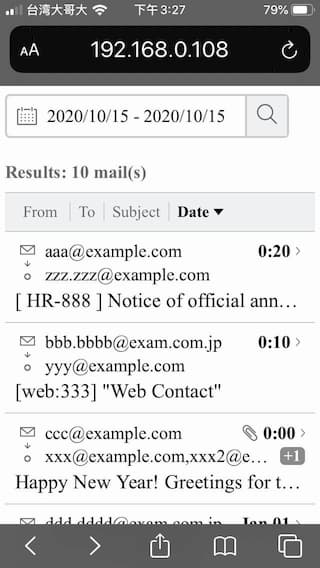

# For anyone looking for reference.
1. I did **NOT** **POST** API successfully. (2020/10)
2. I believe I created a CORRECT RFC6238 token
    - I was able to generate exactly same **"Table 1: TOTP Table"** TOTP token.

But, I still got `Access denied: Invalid token, wrong code`.
- maybe I am wrong, and I already give up to submit my demo.
  - (I start to think maybe, this is not my problem.)
- hope someone POST successfully, and prove me wrong.

You can find some ppl asking or public their code on github
- google some key word
- github search key word

And I think **glassdoor** is also **worth** to read (not relate this challenge)
- https://www.glassdoor.com/Interview/HENNGE-Interview-Questions-E1276040.htm
- (Use **browser's private mode** to pretend first time visitor.)

# About secrets
If you read the RFC6238 document. The doc say
> The test token shared secret uses the ASCII string value "12345678901234567890".

A lot of ppl confusing:
- What is **12345678901234567890**, and
- Why using `seed64` in the document's sample code ?

```java
String seed64 = "3132333435363738393031323334353637383930" +
         "3132333435363738393031323334353637383930" +
         "3132333435363738393031323334353637383930" +
         "31323334";
```

So
- **12345678901234567890** is (token shared) secret, just a random string.
- **3132333435363738393031323334353637383930** is **12345678901234567890**'s ASCII HEX encoded
- for `HMAC-SHA512`, we need 64 bytes seed. Just **repeat** the string, then we got **seed64**
  - (hex encode: Encode each **byte** as two hexadecimal characters.)

```javascript
// nodejs
Buffer("12345678901234567890", 'ascii').toString('hex')
// 3132333435363738393031323334353637383930
```

If you are using 3rd parity library
- I think library will do the ASCII hex encode for you.
- You can use **12345678901234567890** as secret to test, to generate same **"Table 1: TOTP Table"**'s result.
  - **"Table 1: TOTP Table"**'s first col "Time (sec)" is "Unix epoch". when you setting lib's config, maybe is "UNIX time * 1000", e.x: "59 * 1000" (depend on your language or library.)
- read your 3rd parity library's test and source code may help you more understand that library.


---------------------------------------------------------
---------------------------------------------------------
---------------------------------------------------------
---------------------------------------------------------
# Jacky's HENNGE Admission Challenge 003 (**unsubmitted**)
- [REPORT.md](./REPORT.md)
- [IMPROVEMENTS.md](./IMPROVEMENTS.md)

## about this demo
- framework: `react` (`create-react-app`)
- style engine: css-in-js (`styled-components`)
- others
  - `storybook` for UI component develop

## Clone and Install
```
git clone https://github.com/flameddd/hennge_challenge
cd hennge_challenge
npm install
npm start
```

then visit `http://localhost:3000/`

## Date Set
- [dataset.js](./src/dataset.js)
- email date range from `2019/12/31 0:30` to `2020/1/3 0:20`
- filter **Out of above date range** to see **Empty Result** page.

## Folder structure and File 

```
\---src
  |   App.js            // App Entry, Layout
  |   colors.js         // define color palette
  |   constants.js      // define constant, enums
  |   dataset.js        // fake data set for demo 
  |   
  +---assets            // image asset from "frontend_resources.zip" 
  +---Components        // UI components
  |     EmptyResult.js
  |     ExtendMail.js
  |     Normalize.js
  |     ResultTitle.js
  |     DatePicker.js
  |     Table.js
  | 
  \---utils           // utility function
\---screenshots       // image for README, REPORT and IMPROVEMENTS present
```


# Screenshots  

||
|:----------:|
|desktop|

||
|:----------:|
|hover|

||
|:----------:|
|mail extended|

||
|:----------:|
|mail extended|

||
|:----------:|
|date picker|

||
|:----------:|
|result 0|


||||
|:----------:|:----------:|:----------:|
|mobile|scroll|mail extended|
||||
||||
|mail extended|date picker| result 0|
