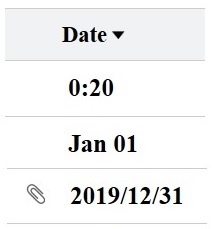
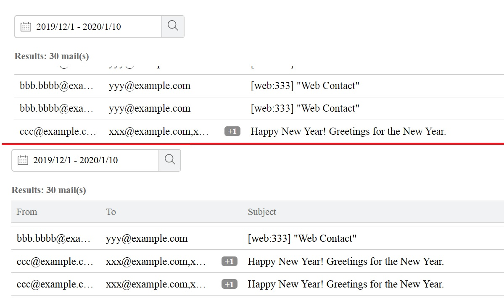
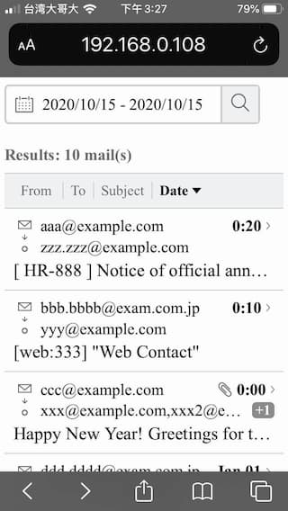
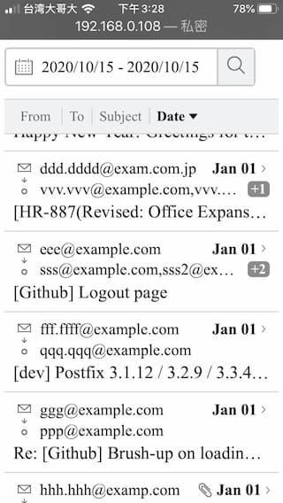
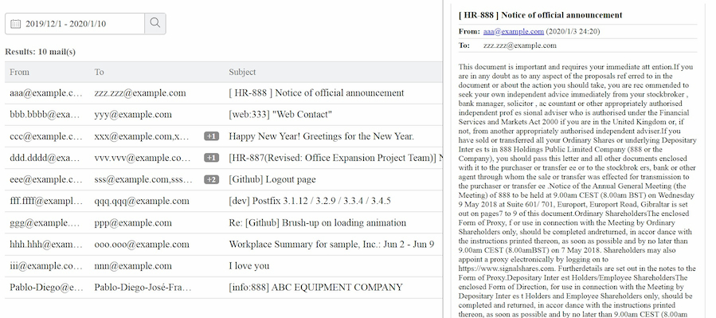
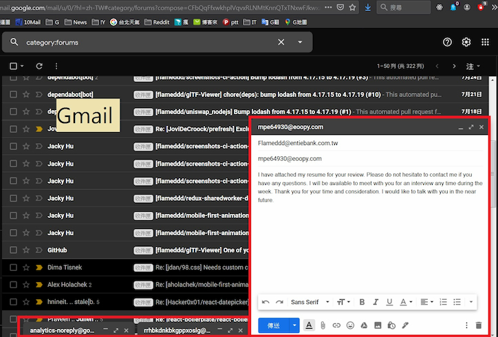
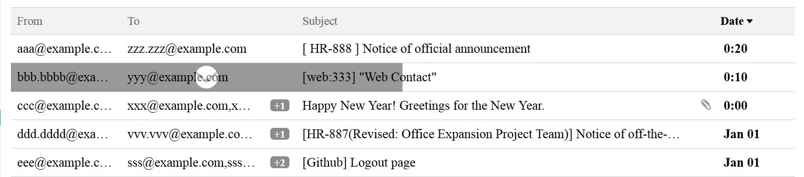
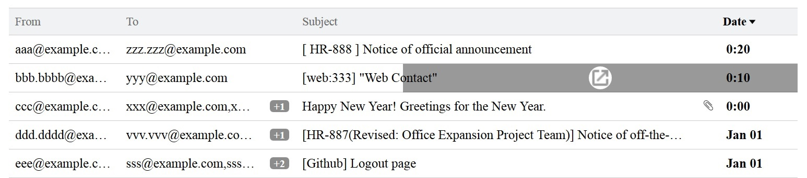

# REPORT
- describing your efforts in the process of completing the missions above

## 1. Init project
1. create react init project (create-react-app)
2. add `eslint`, `prettier` and `husky (git-hooks)` for improvement code quality
3. add `storybook` for develop UI components
4. add `styled-components` for styling

## 2. Thinking "design"
At begin, I divide "design" into small and independent task.
- normalize css 
- application layout
- UI Component
  - search bar (date filter)
    - date picker
  - header
  - table (mail list)
    - table header
    - table item
  - empty result

And analysis **color** to define [color palette](./src/colors.js)
- https://imagecolorpicker.com/


## 3. Develop UI Component
First step, develop UI Component one by one under `storybook`.

### About Table Component (email list)
I develop **desktop** mode firstly, then I thinking mobile (small screen) mode. Should I
- option1: code both desktop and mobile mode in **One** component or
- option2: develop One desktop component and the other mobile component (**Two** component).

**option2**
- Separate into two can make component more readable, clean and single purpose.
- **downside** is must use **javascrip** to detect **window size** to decide render deaktop or mobile component

I chose **option1**, bcuz
1. I believe this component will NOT too complicate. UI is not complicate and it's just an mockup and there is no business logic here.
2. I want use **CSS** to implement this desktop/mobile mockup. **javascript** is over engineering here.

`flexbox` vs `grid`
- At first, I use `flexbox` to develop **desktop Table component**. Then what I find it will too complicate if I use `flexbox` to implement both desktop and mobile TableItem (email) into One component.  

After few tried, I decided to use `grid` layout to implement this component

### About text format of email date
- according design, there are **THREE** different date format.
  - "0:20"
  - "Jan 01"
  - "2019/12/31"

  

I assume the display logic is:
```js
function formatArchiveDate (baseDate, archiveDate) => {
  if (baseDate and archiveDate are EXACTLY SAME DAY) {
    return "hour:minute"
  }
  if (baseDate and archiveDate are EXACTLY SAME MONTH) {
    return "month:day"
  }
  return "year/month/day"
}
```

then implement this date formatter in [utils](./src/utils/index.js)  

### About Table's sort feature
- I discovered an issue when I implement this feature. I describe in [IMPROVEMENTS.md](./IMPROVEMENTS.md)

## 4. Application layout
The layout of design is straightforward, not complicate. I just want to mention few things I  have down here:  

On desktop mode:
- I give **Table** (mail list) an fixed height and scrollable. When table scroll down, the **Table Header** will disappear (been scrolled)
  - I feel this **User Experience** is **NOT** good.
  - There is a **clickable** (sort) feature on the **Header** (You have to scroll to the top for click, once table been scroll down). 

So I **sticky** the header when scroll.


on mobile mode:
- **Table** don't have fixed height. Instead, whole page is scrollable, and I think this design is more fit **Mobile User Experience**.
- Not only **Table Header** is **sticky**, but also **date filter** is **sticky** too. Otherwise, user **Have To Scroll to the Top** to use **date filer** when scroll down.
- The **Address Bar** will be hide when when user **scroll down**

|||
|:----------:|:----------:|
||**sticky** and **Address bar** been hidden when scroll |


## 5. Extend the UI (Mission 2)
At begin, I thinking two way
- extend from right or
- extend from bottom

|||
|:----------:|:----------:|
|extend from right (**unused**)|extend from bottom (**unused**)|

But, those of two design are **NOT** able to **inspect multiple email bodies at once.**  

I also think to use **"Open New Window"**, but new window is **NOT** a kind of **extend** I think.  

In the end, I decide to extend mail from **TableItem**.  
 
| **Unused** design (bcuz it not follow design's hover effect) |
|:----------:|
|  |
|Top: Extend mail by click left side.|
|Bottom: Open new window by click right side.|


## 6. date picker
I decided to use 3rd parity date picker library, because
- To implement a functionable data picker (not just mockup) is a little time consuming.
- according to CHALLENGE DETAILS: "Do not hesitate to use source codes or tools on the net".
- mockup design doesn't include date picker.

I start to searching library, and there are two great library
1. **react-dates**: https://github.com/airbnb/react-dates (created by `airbnb`)
2. **react-date-range**: https://github.com/hypeserver/react-date-range

At first, I chose `react-date-range`, because `react-dates` depend on `Moment.js`.
- Usually, `Moment.js` is overhead for web.
- (`react-date-range` depend on `date-fns`)

Then, I find out `react-date-range` are **NOT** able to replace/customize its appearance easily.  

So, I switch back to `react-dates`.
